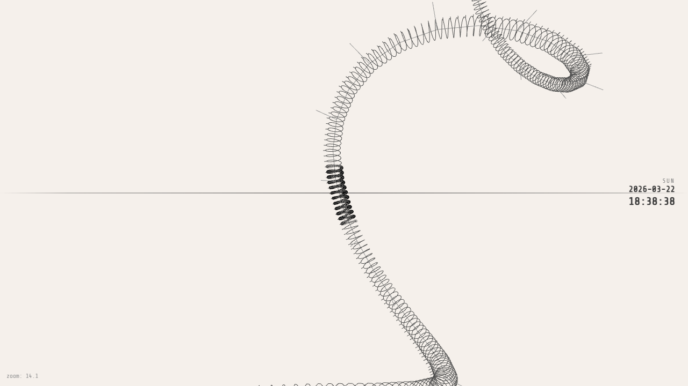

# Helix Calendar

> **Work in progress** — this project is being vibe-coded and is under active development.

A recursive 3D time-helix calendar where nested coils represent time from centuries down to minutes. Time flows as a coiling strand through 3D space — zoom in to reveal finer time scales, from decades down to individual minutes.



## Development

```bash
npm install
npm run dev
```

Opens at http://localhost:3000

## Controls

- **Left-click drag** — Orbit / rotate the 3D view
- **Right-click drag** — Scrub through time (down = forward, up = backward)
- **Scroll wheel** — Zoom between time levels
- **Click time display** — Jump to specific date
- **"Now" button** — Return to current time

## Helix Levels

| Level | Coils around | 1 revolution = |
|-------|-------------|----------------|
| Year | Spine | 1 decade |
| Month | Year helix | 1 year (12 coils) |
| Day | Month helix | 1 month (28-31 coils) |
| Hour | Day helix | 1 day (24 coils) |
| Minute | Hour helix | 1 hour (60 coils) |

Each deeper level appears as you zoom in. Parent helixes fade to grey for readability.

## Tech Stack

React, Three.js (React Three Fiber), Zustand, Vite, TypeScript
